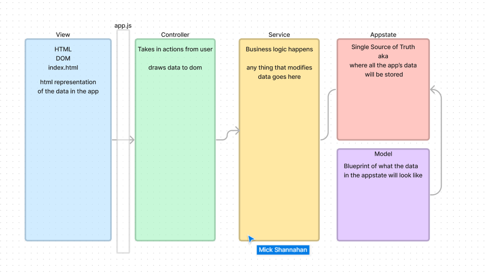

# MVC

# Mick's lecture Aug. 21 - design patterns

check figma - https://www.figma.com/file/g5YmEFVGKAF2BWUqQJ3ng6/MVCS-Diagram?node-id=0%3A1&t=BB2R4cKdv1A60Oth-0
has service and state centers for process

 <--added to notes section

View and controller are dir interacting, but behind view is a series of info boxes related to the actions that go into the controller
Controller as segue to business logic which is stored in the service sector

appstate holds stable code - such as arrays

bcw create <---- will be the code used in command prompt from now on -- faster than touch
download frameworks that come with own template - like react or vue

we are doing mvc today

can do git init  Y/N <--will push to personal github, so be careful about this if you have multiple you operate
 CANNOT do "code .", but enter into as prompted
 still one linked file to HTML, but only main "controller"
 main.csss is the bootstrap

 package json  -- dependencies - copy internet code into own, node modules <-- important in two weeks (bootstrap and sass)
 bypasses cdn link that is not active until loaded, comms directly to the program

 class Character {}  <-- cap Character because it is a ref to definitions
 ^ all keys are empty, is a blueprint, not object is entered, just what values they will hold per character

 classes create blueprint for onject data

 so let Ent = new Character <-- get new character -- adds object to character array
 w/in class, set 
 constructor(data key, data key2, data key....){  <----temp vara as parameters for the scope of this function, do not actually link to the Character keys *themselves*
    ^ this provides for each time you build new Character
    <!-- where do yuo put these materials -->
this.dataKey = newKey
this.dataKey2 = newKey2
this.dataKey... = newKey...
 }
<!-- *NOTE - this is a context for a class instance to look at itself -->
this. <---object looking at self
instance member -- properties, members are whatever exist on class

can add functions w/in now that can ref these keys for each character ie - can ref themselves, multiple chars cannot ref each other (with this setting) you have context of self only

   # SECTION - AppState JS

    Focus mainly, today, on class OvservalbeAppState extends EventEmitter{
place to sroe all of data
create arrays
Characters[
    new Character <----orange icon option *these will nt work without ref to other page WHERE CHARACTER WAS ACTUALLY DEFINED
    ^ must import, only works if it has been exported
]

        <!-- right now, even ignore page=`` -->
    }

# *NOTE - how to import - type out what you want to import and it will finish, but do not type out whole, as typos in import statement are hard to find

    SO export class Character{}

    top of page, type "Character" and press tab, will auto gen, but SINCE FILE IS OPEN IN OTHER TAB only when open in other tab, can auto generate the import line

    xCode, jetbrain, and vs code as major industry players

    AppState data is not accessible within console = you cannot pour lighter fluid into engine while driving

    within init() can throw things into console

   # SECTION - create new controller
 this js file will be wholly exported to everything else
 write the entire file withong a controller class

 export class CharactersController() {
constructor(){
    console.log('this log will not show on page')
}

 }

*ANCHOR - app.js is what is pulled into HTML
SO within this app.js is a router, essentially
router.js has a path, controller, and view <--what gets loaded into page

can change objects w/in an array that is a const - can change data within, but not the structure around it

w/in 
 export class CharactersController() {

constructor(){
    console.log('this log will not show on page')
    this.drawCharacters()
}

drawCharacters(){
<!-- AppState.characters <--will open dropdown of options -->

let content = ``

AppState.characters.forEach(character => content += character.name)
document.getElementById('characters').innerHTML = content
                            ^this does not exist on HTML, but does on router
}

 }

parseInt => turns string to number by pulling internal number from prompt

window.prompt vs alert ==> can enter info

*NOTE - functions in controller only responsible for taking in actions and does NOT perform data manipuation (business logic)
   # SECTION - services

class CharactersService() {

yourFunction(para1, para2){
    same info from controller
    console.log to see if you passed the values from one js file to another
}

}
wxport const characterService = new CharacterService()

app only knows controller, system does not deal with anything else -- still all front end

throw characterService. into characterController

load order of imports is important if one refers to another

use "get" similar to function, but goes without parameters, runs as a property with value ONCE you access it

*REVIEW - in general, start with model - what does the data look like, what do you need to support within app

stick some of those in AppState

create controller, have controller draw data (either html or string concatenate)

add interactions to page elements

the rest...

   # SECTION - 
